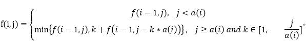

#### 题目
给定不同面额的硬币 coins 和一个总金额 amount。编写一个函数来计算可以凑成总金额所需的最少的硬币个数。如果没有任何一种硬币组合能组成总金额，返回 -1。

示例 1:

输入: coins = [1, 2, 5], amount = 11
输出: 3 
解释: 11 = 5 + 5 + 1
示例 2:

输入: coins = [2], amount = 3
输出: -1
说明:
你可以认为每种硬币的数量是无限的。
***
#### 自己的解法
思路：动态规划。定义 f(i, j) ：a[0...i]可组成amount的最少硬币个数。则状态转移方程为：
</br>
边界条件：
f(1, 0) = 0, 0<=i<n
f(0, j) = j/a(i) or amount+1;
```java
class Solution {
    public int coinChange(int[] a, int amount) {
        if(a==null){
            return -1;
        }
        
        int n = a.length;
        int[][] f = new int[n][amount+1];
        
        // 给数组填充初始值
        for(int j=0; j<f.length; j++){
            Arrays.fill(f[j], amount+1);
        }
        
        // 边界：f(i,0) = 0
        for(int i=0;i<n;i++){
            f[i][0] = 0;
        }
        
        // 边界：f(0,j) = j/a(i) or amount+1
        for(int j=1;j<=amount;j++){
            if(j % a[0]==0){
                f[0][j] = j/a[0];
            }
        }
        
        for(int i=1;i<n;i++){
            for(int j=1;j<=amount;j++){
                f[i][j] = f[i-1][j];
                if(j>=a[i]){
                    for(int k=1;k<=j/a[i];k++){
                        f[i][j] = Math.min(f[i][j], k + f[i-1][j-k*a[i]]);
                    }
                }
            }
        }
        
        return f[n-1][amount]==amount+1 ? -1 : f[n-1][amount];
    }
}
```
***
#### 好的解法：
思路：同样是动态规划，只不过状态由二维变为一维的，其实416题分割等和子集那题的状态变量同样可以设置为1维的。
**状态**：dp[v]代表“装满”总金额v的最少硬币数
**状态转移方程**：dp[v] = min( dp[v], dp[v - coins[i] ] + 1)
```java
class Solution {
    public int coinChange(int[] a, int amount) {
        if(a==null || a.length==0){
            return -1;
        }
        int n = a.length;
        
        //定义状态：dp[v]代表装满v的最少硬币数
        int[] dp = new int[amount+1];
        
        //边界
        dp[0] = 0;
        //初始状态
        for(int i=1;i<=amount;i++){
            dp[i] = amount+1;
        }
        
        for(int i=0;i<n;i++){
            for(int v=1;v<=amount;v++){
                if(v>=a[i]){
                    dp[v] = Math.min(dp[v], dp[v-a[i]]+1);
                }
            }
        }
        
        return dp[amount]!=amount+1? dp[amount]:-1;
    }
}
```
***
#### 心得：
对于一维状态来说，当前状态dp[i]可以不依赖于dp[i-1]或dp[i+1], 而依赖于dp[j], j不为i+1或i-1。